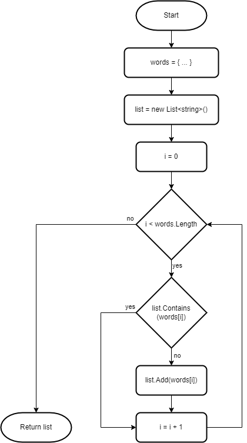
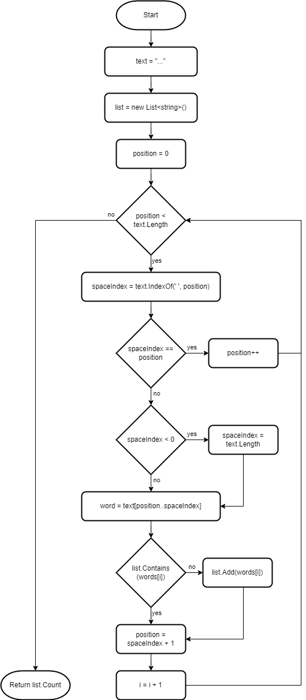

# Unique Words

An intermediate level task for practicing algorithms, loops, collections and work with strings.

Estimated time to complete the task - 2h.

The task requires .NET 6 SDK installed.


## Task Description

In this task you have to implement six static methods that process a text and searches strings for unique words.


### 1. List<T> Collection

Implement the [GetUniqueWordsFromArray](UniqueWords/TextProcessor.cs#L8) method to return the list of unique words in the `words` array. Use the [List&lt;T&gt;](https://docs.microsoft.com/en-us/dotnet/api/system.collections.generic.list-1) class for storing the word list.

```cs
{ "aaa", "bbb", "ccc", "aaa", "bbb", "ccc" } => { "aaa", "bbb", "ccc" }
```



1. Introduce a new `list` variable and assign the new `List<string>` object. Return the list object from the method.

```cs
public static List<string> GetUniqueWordsFromArray(string[] words)
{
    var list = new List<string>();

    return list;
}
```

2. Add the [for statement](https://docs.microsoft.com/en-us/dotnet/csharp/language-reference/statements/iteration-statements) to iterate through a list of words.

```cs
public static List<string> GetUniqueWordsFromArray(string[] words)
{
    var list = new List<string>();

    for (int i = 0; i < words.Length; i++)
    {
    }

    return list;
}
```

3. Add the [if statement](https://docs.microsoft.com/en-us/dotnet/csharp/language-reference/statements/selection-statements#the-if-statement) to check whether a word is added in the list already. Use the [List&lt;T&gt;.Contains](https://docs.microsoft.com/en-us/dotnet/api/system.collections.generic.list-1.contains) method to determine whether a word is in the `list`.

```cs
public static List<string> GetUniqueWordsFromArray(string[] words)
{
    var list = new List<string>();

    for (int i = 0; i < words.Length; i++)
    {
        if (!list.Contains(words[i]))
        {
        }
    }

    return list;
}
```

4. Use the [List&lt;T&gt;.Add](https://docs.microsoft.com/en-us/dotnet/api/system.collections.generic.list-1.add) method to add a word to the `list`.

```cs
public static List<string> GetUniqueWordsFromArray(string[] words)
{
    var list = new List<string>();

    for (int i = 0; i < words.Length; i++)
    {
        if (!list.Contains(words[i]))
        {
            list.Add(words[i]);
        }
    }

    return list;
}
```


### 2. Counting Words

Implement the [CountUniqueWordsInText](UniqueWords/TextProcessor.cs#L18) method to return the number of unique words in the `text` argument. A `text` argument may contain a single word or a list of words separated with space characters (' '). Extra space characters should be ignored.

```cs
"aaa" => 1
"aaa bbb" => 2
"aaa bbb ccc" => 3
```



Use the [List&lt;T&gt;.IndexOf](https://docs.microsoft.com/en-us/dotnet/api/system.collections.generic.list-1.indexof) method for searching an element in the word list.

Ranges were introduced in C# 8.0 allow a convenient and uniform syntax for accessing a flat sequence of list elements.

```cs
string word = text[position..spaceIndex];
```

Anyway, the C# compiler will translate the line above to [String.Substring](https://docs.microsoft.com/en-us/dotnet/api/system.string.substring) method call.

```cs
string word = text.Substring(position, spaceIndex - position);
```


### 3. Enumerable Objects

Implement the [GetUniqueWordsFromEnumerable](UniqueWords/TextProcessor.cs#L28) method to return an enumerable object that has a list of unique strings extracted from the `lines` object. Each line may contain a single word or a number of words separated with a space character.

```cs
{ "aaa", "bbb", "aaa", "bbb" } => { "aaa", "bbb" }
{ "aaa bbb ccc" } => { "aaa", "bbb", "ccc" }
{ "aaa bbb", "bbb ccc" } => { "aaa", "bbb", "ccc" }
```

An *enumerable object* is the logic representation of a sequence. An enumerable object either implements [IEnumerable&lt;T&gt;](https://docs.microsoft.com/en-us/dotnet/api/system.collections.generic.ienumerable-1) (or [IEnumerable](https://docs.microsoft.com/en-us/dotnet/api/system.collections.ienumerable)) interface or has a method named [GetEnumerator](https://docs.microsoft.com/en-us/dotnet/api/system.collections.ienumerable.getenumerator) that returns an enumerator.

1. Introduce a new `list` variable and assign the new `List<string>` object. Return the list object from the method.

```cs
public static IEnumerable<string> GetUniqueWordsFromEnumerable(IEnumerable<string> lines)
{
    var list = new List<string>();

    return list;
}
```

The `List<T>` class implements `IEnumerable<T>` interface, so an instance of the `List<T>` class can be returned from the `GetUniqueWordsFromEnumerable` method without any casts.

The list of interfaces the `List<T>` class implements is available on the [class documentation page](https://docs.microsoft.com/en-us/dotnet/api/system.collections.generic.list-1).

```
Implements ICollection<T>, IEnumerable<T>, IList<T>, IReadOnlyCollection<T>, IReadOnlyList<T>, ICollection, IEnumerable, IList
```

2. Use the [foreach statement](https://docs.microsoft.com/en-us/dotnet/csharp/language-reference/statements/iteration-statements#the-foreach-statement) to iterate over the `lines` object.

```cs
public static IEnumerable<string> GetUniqueWordsFromEnumerable(IEnumerable<string> lines)
{
    var list = new List<string>();

    foreach (string line in lines)
    {
    }

    return list;
}
```

`lines` is an enumerable object since the parameter type is defined as `IEnumerable<string>`.

3. Split the `line` into words using the [String.Split](https://docs.microsoft.com/en-us/dotnet/api/system.string.split) method.

```cs
public static IEnumerable<string> GetUniqueWordsFromEnumerable(IEnumerable<string> lines)
{
    var list = new List<string>();

    foreach (string line in lines)
    {
        IEnumerable<string> words = line.Split(' ', StringSplitOptions.RemoveEmptyEntries | StringSplitOptions.TrimEntries);
    }

    return list;
}
```

The `String.Split` method returns an array of strings. The [Array](https://docs.microsoft.com/en-us/dotnet/api/system.array) class implements `IEnumerable` interface, so all arrays are enumerable objects in .NET.

```
Implements ICollection, IEnumerable, IList, IStructuralComparable, IStructuralEquatable, ICloneable
```

4. Iterate over `words` using the `foreach` statement.

```cs
public static IEnumerable<string> GetUniqueWordsFromEnumerable(IEnumerable<string> lines)
{
    var list = new List<string>();

    foreach (string line in lines)
    {
        IEnumerable<string> words = line.Split(' ', StringSplitOptions.RemoveEmptyEntries | StringSplitOptions.TrimEntries);

        foreach (string word in words)
        {
        }
    }

    return list;
}
```

5. Add a word to the `list`, if a word is not in the `list`.

```cs
public static IEnumerable<string> GetUniqueWordsFromEnumerable(IEnumerable<string> lines)
{
    var list = new List<string>();

    foreach (string line in lines)
    {
        IEnumerable<string> words = line.Split(' ', StringSplitOptions.RemoveEmptyEntries | StringSplitOptions.TrimEntries);

        foreach (string word in words)
        {
            if (!list.Contains(word))
            {
                list.Add(word);
            }
        }
    }

    return list;
}
```


### 4. List To Array Transformation

Implement the [GetUniqueWordsArray](UniqueWords/TextProcessor.cs#L38) method to return a jagged array with only unique words. Each line in the `lines` enumerable objects may contain a single word or a number of words separated with `separator` character.

```
{ { "aaa" }, { "bbb" }, { "ccc" } } => { { "aaa" }, { "bbb" }, { "ccc" } }
{ { "aaa", "bbb" }, { "aaa", "bbb", "ccc" }, { "aaa", "bbb", "ccc", "ddd" } } => { { "aaa", "bbb" }, { "ccc" }, { "ddd" } }
{ { "aaa-bbb", "ccc-aaa" }, { " bbb-ddd ", "ddd - aaa", " eee - fff " } } => { { "aaa", "bbb", "ccc" }, { "ddd", "eee", "fff" } }
```

Space characters should be removed from the strings coming from the `line` enumeration object.

At first implement the method using the `String.Split` method for splitting lines into words. Then change the method implementation - remove the `String.Split` method and use the [String.IndexOf](https://docs.microsoft.com/en-us/dotnet/api/system.string.indexof) and [String.Substring](https://docs.microsoft.com/en-us/dotnet/api/system.string.substring) methods for word extraction. The final implementation should have no `String.Split` method calls.

To transform an object of the `List<T>` type to an array use the [List&lt;T&gt;.ToArray](https://docs.microsoft.com/en-us/dotnet/api/system.collections.generic.list-1.toarray) method.


### 5. New Line

Implement the [GetUniqueWordsCollection](UniqueWords/TextProcessor.cs#L48) method to return a collection of unique words extracted from the `text`. The `text` argument may contains a single word or a number of words separated with `separator` character. Also, the `text` may contain newline strings.

```
"aaa
bbb
ccc" => { "aaa", "bbb", "ccc" }

"aaa:bbb
bbb:ccc" => { "aaa", "bbb", "ccc" }

"aaa:bbb
ccc:ddd" => { "aaa", "bbb", "ccc", "ddd" }
```

Implement the method using the `String.IndexOf` method and ranges for word extraction. The method implementation should have no `String.Split` or `String.Substring` method calls. Also, avoid extra memory allocations when getting a substring using ranges. A range should be used only for extracting a word, not a whole line.

Use the [Environment.NewLine](https://docs.microsoft.com/en-us/dotnet/api/system.environment.newline) property to get a newline string. A newline string is different on various platforms. Never use escape characters (`\r\n` or `\n`) to designate a newline in string literals.


### 6. Collections

Implement the [CountUniqueWordsInCharCollection](UniqueWords/TextProcessor.cs#L58) method to return a number of unique words in the `collection` of characters. Chars in the `collection` are separated with the `separator` character. A space character (' ') should be ignored.

```cs
{ 'a', 'a', 'a', ',', 'a', 'a', 'a' } => 1
{ 'a', 'a', 'a', ',', 'b', 'b', 'b' } => 2
{ 'a', 'a', 'a', ',', 'b', 'b', 'b', ',', 'a', 'a', 'a', ',', 'b', 'b', 'b' } => 2
```

The [ICollection&lt;T&gt;](https://docs.microsoft.com/en-us/dotnet/api/system.collections.icollection) interface implements `IEnumerable<T>` interface. That means you can iterate through the `collection` argument using the `foreach` statement. Also, an `ICollection<T>` interface has the [Count](https://docs.microsoft.com/en-us/dotnet/api/system.collections.generic.icollection-1.count) property that returns the number of elements contained in a collection.

Use `List<T>` collections to store a list of characters for a single word as well as a list of words.

The `List<T>` class implements `ICollection<T>` interface, so an instance of the `List<T>` class can be returned from the `CountUniqueWordsInCharCollection` method without any casts.


## See also

* [Indices and ranges](https://docs.microsoft.com/en-us/dotnet/csharp/whats-new/tutorials/ranges-indexes)
* C# Language Reference
  * [Selection statements](https://docs.microsoft.com/en-us/dotnet/csharp/language-reference/statements/selection-statements)
  * [Iteration statements](https://docs.microsoft.com/en-us/dotnet/csharp/language-reference/statements/iteration-statements)
* .NET API
  * [List&lt;T&gt; Class](https://docs.microsoft.com/en-us/dotnet/api/system.collections.generic.list-1)
  * [String Class](https://docs.microsoft.com/en-us/dotnet/api/system.string)
  * [Array Class](https://docs.microsoft.com/en-us/dotnet/api/system.array)
  * [IEnumerable&lt;T&gt; Interface](https://docs.microsoft.com/en-us/dotnet/api/system.collections.generic.ienumerable-1)
  * [ICollection&lt;T&gt; Interface](https://docs.microsoft.com/en-us/dotnet/api/system.collections.icollection)
  * [Environment Class](https://docs.microsoft.com/en-us/dotnet/api/system.environment)
